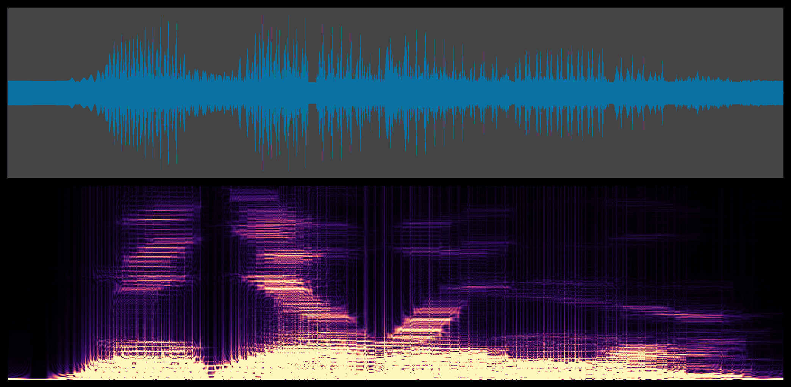
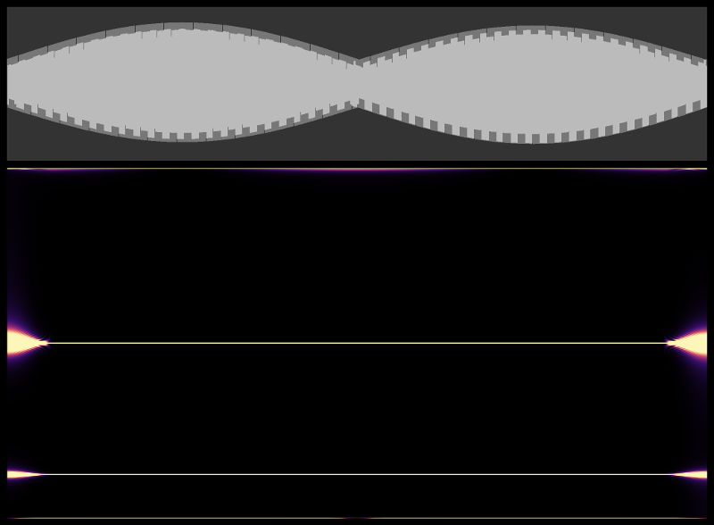

# Spectrogram

Taking an audio signal (wav) and converting it into a spectrogram. Written in Go programming language.



# Install

git clone https://github.com/xigh/spectrogram

# Example

python3 sine_wav.py && ../../xigh/spectrogram/spectrogram -hamming -hideavg -bins=256 sine.wav



# Usage
  ./spectrogram [options] input_file.wav

```
-preemp float64
    set pre-emphasis parameter (0 means no pre-emp)
-rectangle
    disable hamming window support
-BG0 string
    set background color 0 (default "000000")
-BG1 string
    set background color 1 (default "333")
-BG2 string
    set background color 2 (default "447744")
-FG0 string
    set forground color 0 (default "0972a2")
-FG1 string
    set forground color 1 (default "6b5f7e")
-RUL string
    set rulers color (default "a0b0c0")
-bins int
    set freq bins (default 512)
-dft
    use dft instead of fft
-height int
    set height (default 450)
-hideavg
    hide average
-hiderulers
    hide rulers
-length int
    set number of samples [0 means all]
-offset int
    sey begin of samples
-out string
    set output filename (default "out.png")
-ratio float
    set ratio (default 0.8)
-width int
    set width (default 2048)
```
